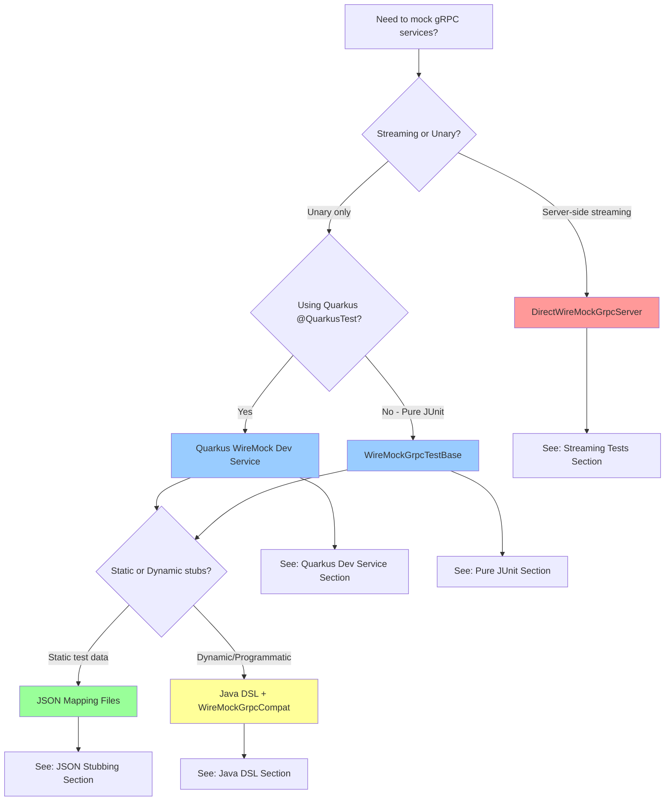

Pipeline gRPC WireMock Testing Framework

## Quick Decision Tree

Choose your testing approach based on your requirements:



### Decision Guide

**[DirectWireMockGrpcServer](#streaming-tests)** - For server-side streaming
- Use when: Testing registration flows, watch endpoints, or any `returns (stream Response)` methods
- Why: WireMock gRPC extension only supports unary calls
- Trade-off: Custom server implementation, more setup code

**[Quarkus WireMock Dev Service](#quarkus-dev-service-approach)** - For Quarkus integration tests
- Use when: Testing Quarkus applications with `@QuarkusTest`
- Why: Automatic lifecycle management, configuration injection
- Trade-off: Requires Quarkus test runtime

**[WireMockGrpcTestBase](#pure-junit-approach)** - For pure JUnit tests
- Use when: Non-Quarkus tests or need explicit control
- Why: Lightweight, no Quarkus dependency
- Trade-off: Manual server lifecycle in `@BeforeEach/@AfterEach`

**[JSON Mapping Files](#json-stubbing-approach)** - For declarative, static test data
- Use when: Test data doesn't change, want zero Java DSL code
- Why: Reusable across tests, easy to maintain, version control friendly
- Trade-off: Less type safety, manual JSON editing

**[Java DSL + WireMockGrpcCompat](#java-dsl-approach)** - For programmatic, dynamic stubs
- Use when: Need test-specific data, templating, or conditional stubbing
- Why: Type-safe, IDE autocomplete, flexible
- Trade-off: More verbose than JSON files for static data

---

## Overview
- This module provides reusable utilities to mock gRPC services using WireMock Standalone and the WireMock gRPC Extension Standalone only (no non-standalone artifacts).
- It includes a small compatibility shim (WireMockGrpcCompat) that allows you to use the convenient Java DSL (message/equalToMessage/jsonTemplate) with your project's com.google.protobuf messages, even though the standalone artifacts shade protobuf into wiremock.com.google.protobuf.
- For streaming scenarios not supported by the WireMock gRPC extension (unary-only), a simple DirectWireMockGrpcServer is included to demonstrate and support streaming tests.

Why a shim? (Architecture and rationale)
- Standalone artifacts shade dependencies to avoid classpath conflicts. The gRPC extension’s DSL methods like message(MessageOrBuilder) and equalToMessage(...) expect shaded types (wiremock.com.google.protobuf...). Your project uses the standard com.google.protobuf types.
- Result: calling those methods directly fails with a type mismatch when using the standalone JARs.
- Our shim converts your MessageOrBuilder to JSON using ProtoJson and delegates to the JSON-based DSL (json/jsonTemplate and equalToJson under the hood), which is agnostic to shading.
- This keeps tests idiomatic and compact while remaining 100% compatible with the standalone setup.

Textual architecture view
- Test code → WireMockGrpcCompat.message/equalToMessage → ProtoJson.toJson → WireMock gRPC extension (JSON-based stubbing) → WireMock Standalone
- For streaming tests: Client → DirectWireMockGrpcServer (custom service impl) → emits onNext(...) events; WireMock is still available for general matching where needed

Key modules/classes
- WireMockGrpcCompat: A tiny adapter exposing method, json, jsonTemplate, message(MessageOrBuilder), equalToMessage(MessageOrBuilder). It solves shaded protobuf incompatibility by converting to JSON.
- ProtoJson: Uses com.google.protobuf.util.JsonFormat to serialize your protos. Configured to include default values and omit insignificant whitespace.
- PlatformRegistrationMock, AccountManagerMock, SimpleServiceMock: Ready-to-use, focused helpers for quickly stubbing specific services or simple unary operations.
- ServiceMocks: Convenience aggregator to obtain and initialize multiple mocks in one place during tests.
- WireMockGrpcTestBase, WireMockGrpcTestResource: Test scaffolding for JUnit 5 and Quarkus to boot WireMock with the gRPC extension and inject ports/config.
- DirectWireMockGrpcServer: Minimal example server for streaming tests where WireMock’s gRPC extension is intentionally bypassed (extension supports unary only).

Quick start (JUnit 5 example)
1) Start WireMock with the gRPC extension in your test base:
   - See WireMockGrpcTestBase or WireMockGrpcTestResource for ready-to-use scaffolding.
   - This configures a dynamic port and makes it available to your clients (e.g., via system properties).

2) Create a WireMockGrpcService for your gRPC service name:
   - WireMockGrpcService mockSvc = new WireMockGrpcService(new com.github.tomakehurst.wiremock.client.WireMock(wm.getPort()), "com.example.MyService");

3) Stub using the compat DSL for requests and responses:
   - mockSvc.stubFor(
       method("MyUnary")
         .withRequestMessage(equalToMessage(MyRequest.newBuilder().setId("123")))
         .willReturn(message(MyResponse.newBuilder().setStatus("OK"))));

4) Use templates when dynamic responses are useful:
   - mockSvc.stubFor(
       method("MyUnary")
         .willReturn(jsonTemplate("{ \"status\": \"Hello {{jsonPath request.body '$.id'}}\" }")));

Creating new service mocks
- Identify your service’s fully-qualified name (the SERVICE_NAME constant from the generated *Grpc class).
- Construct a WireMockGrpcService with WireMock(wireMockPort) and the service name.
- Use methods from WireMockGrpcCompat:
  - method("YourMethodName") to start a stub mapping
  - withRequestMessage(equalToMessage(YourRequest.newBuilder() ... )) to match inputs
  - willReturn(message(YourResponse.newBuilder() ... )) for fixed responses, or json/jsonTemplate for JSON-based
- Optional: wrap repeated stubs in a small helper class similar to PlatformRegistrationMock to keep tests tidy.

Streaming tests
- WireMock gRPC extension supports unary calls only. For server streaming tests, use DirectWireMockGrpcServer:
  - DirectWireMockGrpcServer server = new DirectWireMockGrpcServer(0);
  - server.start();
  - int grpcPort = server.getGrpcPort();
  - Connect your client to grpcPort and perform calls that receive multiple onNext(...) events.
- See DirectWireMockStreamingWorkingTest for a complete example.

Practical tips
- Descriptor files: When running WireMock in standalone mode with files, make sure your compiled descriptors (*.dsc/*.desc) are in wiremock/grpc, as per WireMock docs (see reference-code/wiremock-grpc-extension/README.md).
- Matching: Prefer equalToMessage(...) from the compat class to keep code ergonomic; internally it uses equalToJson so it remains robust across shaded vs. unshaded protos.
- Limitations: For bidirectional or client streaming, craft custom servers (as shown) or refactor tests to unary exchanges.

References
- reference-code/wiremock
- reference-code/wiremock-grpc-extension
- reference-code/wiremock-grpc-demos

FAQ
- Why not use the non-standalone artifacts? This project must use standalone only; the shim preserves the ergonomic API while remaining compatible.
- Could we remove the shim? Yes, by calling WireMockGrpc.json(ProtoJson.toJson(...)) and equalToJson(...) directly everywhere, but that spreads JSON conversions throughout tests and reduces readability. The shim centralizes this concern with minimal code.


Using descriptor files + pure JSON stubbing (Standalone-friendly)
- grpc-stubs packs the descriptor set into its JAR at META-INF/grpc/services.dsc (see grpc/grpc-stubs/build.gradle).
- WireMockGrpcTestBase and WireMockGrpcTestResource start WireMock with the gRPC extension and set the root to the META-INF classpath folder. The extension then discovers descriptors under META-INF/grpc automatically.
- Define your stubs in JSON under META-INF/mappings on the test classpath. The request URL path is /<fully-qualified service name>/<MethodName> and the method must be POST.
- Example mapping: src/test/resources/META-INF/mappings/platform-registration-list-services.json
  {
    "request": {
      "urlPath": "/io.pipeline.platform.registration.PlatformRegistration/ListServices",
      "method": "POST",
      "bodyPatterns": [{ "equalToJson": "{}" }]
    },
    "response": {
      "status": 200,
      "body": "{ \n  \"services\": [ { \n    \"serviceName\": \"repository-service\", \n    \"serviceId\": \"repo-1\", \n    \"host\": \"localhost\", \n    \"port\": 8080, \n    \"version\": \"1.0.0\", \n    \"isHealthy\": true \n  } ], \n  \"totalCount\": 1 \n}",
      "headers": { "grpc-status-name": "OK" }
    }
  }
- A JUnit example that consumes this mapping is in PlatformRegistrationJsonStubbingTest. It connects to the WireMock port and invokes ListServices, asserting the stubbed response.
- Notes:
  - Keep using JSON stubs for unary interactions when you want zero Java DSL usage (recommended for standalone). The compat shim remains available when writing stubs programmatically in tests.
  - For streaming methods, the gRPC extension can’t stream; use DirectWireMockGrpcServer for streaming tests.


Consuming grpc-wiremock in your tests (API-scoped, versions pinned)
- This module is intended for use inside this multi-module repo and pins versions for you.
- All key test-time dependencies are exported in API scope so consumers only need a single testImplementation on this module.
- What you get transitively when you depend on this module:
  - org.wiremock:wiremock-standalone:3.13.1
  - org.wiremock:wiremock-grpc-extension-standalone:0.11.0
  - io.quarkiverse.wiremock:quarkus-wiremock:1.5.1 (Quarkus WireMock Dev Service)
  - io.quarkus:quarkus-junit5, io.quarkus:quarkus-test-common
  - io.quarkus:quarkus-grpc, io.quarkus:quarkus-mutiny
  - io.pipeline:grpc-stubs (transitively provides META-INF/grpc/services.dsc descriptors)

How consumers use it (two common paths)
1) Quarkus-based tests (using the Quarkus WireMock Dev Service)
   - Consumer build.gradle:
     
     testImplementation "io.pipeline:grpc-wiremock:1.0.0-SNAPSHOT"
     
   - Consumer src/test/resources/application.properties:
     
     quarkus.wiremock.devservices.enabled=true
     quarkus.wiremock.devservices.extension-scanning-enabled=true
     quarkus.wiremock.devservices.files-mapping=classpath:META-INF
     quarkus.wiremock.devservices.global-response-templating=true
     
   - Place JSON mappings under src/test/resources/META-INF/mappings/.
     The gRPC descriptor set is available via grpc-stubs at META-INF/grpc/services.dsc.
   - Programmatic unary stubs (optional): create a WireMockGrpcService pointing to the Dev Service port and use the compat shim methods:
     - method(...), equalToMessage(...), message(...), jsonTemplate(...)
     The Dev Service port is exposed at quarkus.wiremock.devservices.port.
   - Streaming tests: use DirectWireMockGrpcServer from this module. It starts a real gRPC server to emit onNext(...) sequences. WireMock gRPC extension is unary-only.

   Example (programmatic unary in a Quarkus test)
   - Read the Dev Service port (if you need to build a channel yourself):
     - Integer port = org.eclipse.microprofile.config.ConfigProvider.getConfig().getValue("quarkus.wiremock.devservices.port", Integer.class);
   - Stub with the compat shim:
     - WireMockGrpcService svc = new WireMockGrpcService(new com.github.tomakehurst.wiremock.client.WireMock(port), "io.pipeline.platform.registration.PlatformRegistration");
     - svc.stubFor(method("ListServices").willReturn(json("{ \"totalCount\": 1 }")));

2) Pure JUnit (no Quarkus) tests
   - Consumer build.gradle:
     
     testImplementation "io.pipeline:grpc-wiremock:1.0.0-SNAPSHOT"
     
   - Extend the provided WireMockGrpcTestBase (JUnit 5) to start WireMock + gRPC extension with META-INF classpath support:
     - It sets a dynamic port, points WireMock at classpath META-INF for mappings, and sets the system property test.wiremock.port for clients.
   - Alternatively, use WireMockGrpcTestResource if you’re in a Quarkus test but prefer explicit resource control.
   - Use either JSON mapping files (recommended) or the compat Java DSL in your tests. For streaming, use DirectWireMockGrpcServer.

   Example (JSON-only stub via classpath mappings)
   - Create src/test/resources/META-INF/mappings/my-service-unary.json with:
     {
       "request": {
         "urlPath": "/com.example.grpc.MyService/MyUnary",
         "method": "POST",
         "bodyPatterns": [ { "equalToJson": "{}" } ]
       },
       "response": {
         "status": 200,
         "body": "{ \n  \"value\": \"Hello\" \n}",
         "headers": { "grpc-status-name": "OK" }
       }
     }
   - In your test, create a channel to localhost:getWireMockPort() (from WireMockGrpcTestBase) and call the unary method.

Port routing for clients
- Quarkus Dev Service port: quarkus.wiremock.devservices.port (exposed automatically when the Dev Service runs).
- JUnit base class property: test.wiremock.port is set for convenience.
- For streaming scenarios, expose a custom property from your @QuarkusTestResource that starts DirectWireMockGrpcServer (e.g., test.grpc.streaming.port) and point clients that need streaming to that port.

When to use which approach
- Descriptor + JSON stubs (recommended): best for reuse, declarative tests, and standalone alignment.
- Compat Java DSL: best for ad-hoc stubs inside a test method with ergonomic message(...) and equalToMessage(...).
- DirectWireMockGrpcServer: for server/client/bidi streaming that the gRPC extension cannot model.

Notes on versions and scopes
- All versions are pinned in this module; consumers do not need to add or manage individual WireMock/gRPC testing dependencies.
- Dependencies are exposed via API scope so a single testImplementation on io.pipeline:grpc-wiremock is sufficient.

---

## Detailed Approach Sections

### <a name="streaming-tests"></a>Streaming Tests with DirectWireMockGrpcServer

**When to use:** Testing server-side streaming gRPC methods (registration flows, watch endpoints, etc.)

**Why this approach:** The WireMock gRPC extension only supports unary calls (single request → single response). For streaming responses, you need a real gRPC server implementation.

**Setup:**
```java
public class MyStreamingTest {
    private DirectWireMockGrpcServer mockServer;

    @BeforeEach
    void setUp() throws IOException {
        mockServer = new DirectWireMockGrpcServer(0); // 0 = dynamic port
        mockServer.start();
    }

    @AfterEach
    void tearDown() throws InterruptedException {
        mockServer.stop();
    }

    @Test
    void testStreamingRegistration() {
        int grpcPort = mockServer.getGrpcPort();
        ManagedChannel channel = ManagedChannelBuilder
            .forAddress("localhost", grpcPort)
            .usePlaintext()
            .build();

        PlatformRegistrationGrpc.PlatformRegistrationStub stub =
            PlatformRegistrationGrpc.newStub(channel);

        List<RegistrationEvent> events = new ArrayList<>();
        CountDownLatch latch = new CountDownLatch(1);

        stub.registerService(request, new StreamObserver<RegistrationEvent>() {
            public void onNext(RegistrationEvent event) {
                events.add(event);
            }
            public void onCompleted() {
                latch.countDown();
            }
        });

        latch.await(5, TimeUnit.SECONDS);
        assertEquals(6, events.size()); // All 6 registration events received
    }
}
```

**Key points:**
- Emits proper streaming sequences (STARTED → VALIDATED → ... → COMPLETED)
- Full control over event timing and content
- Can simulate failures, delays, and complex flows

**Example test:** `DirectWireMockStreamingWorkingTest`

---

### <a name="quarkus-dev-service-approach"></a>Quarkus WireMock Dev Service Approach

**When to use:** Quarkus integration tests with `@QuarkusTest` where you want automatic WireMock lifecycle

**Why this approach:** Zero boilerplate - Quarkus automatically starts WireMock with gRPC extension during test initialization

**Setup:**

**1. Add dependency:**
```gradle
testImplementation "io.pipeline:grpc-wiremock:1.0.0-SNAPSHOT"
```

**2. Configure in `src/test/resources/application.properties`:**
```properties
quarkus.wiremock.devservices.enabled=true
quarkus.wiremock.devservices.extension-scanning-enabled=true
quarkus.wiremock.devservices.files-mapping=classpath:META-INF
quarkus.wiremock.devservices.global-response-templating=true
```

**3. Choose your stubbing approach:**

**Option A: JSON Mapping Files**

Create `src/test/resources/META-INF/mappings/my-service.json`:
```json
{
  "request": {
    "urlPath": "/io.pipeline.myservice.MyService/GetData",
    "method": "POST",
    "bodyPatterns": [{ "equalToJson": "{ \"id\": \"123\" }" }]
  },
  "response": {
    "status": 200,
    "body": "{ \"value\": \"test-data\" }",
    "headers": { "grpc-status-name": "OK" }
  }
}
```

**Option B: Programmatic Java DSL**

```java
@QuarkusTest
public class MyServiceTest {

    @Inject
    @ConfigProperty(name = "quarkus.wiremock.devservices.port")
    Integer wireMockPort;

    @Test
    void testMyService() {
        WireMockGrpcService mockSvc = new WireMockGrpcService(
            new WireMock(wireMockPort),
            "io.pipeline.myservice.MyService"
        );

        mockSvc.stubFor(
            method("GetData")
                .withRequestMessage(equalToMessage(MyRequest.newBuilder().setId("123")))
                .willReturn(message(MyResponse.newBuilder().setValue("test-data")))
        );

        // Your test code here - clients will connect to wireMockPort
    }
}
```

**Key points:**
- WireMock starts automatically before tests
- Port available via `quarkus.wiremock.devservices.port` config property
- gRPC descriptors from grpc-stubs are automatically discovered
- Supports both JSON files and Java DSL

**Example test:** Tests using this approach coming soon

---

### <a name="pure-junit-approach"></a>Pure JUnit Approach with WireMockGrpcTestBase

**When to use:** Non-Quarkus tests or when you need explicit control over WireMock lifecycle

**Why this approach:** Lightweight, no Quarkus dependency, works in any JUnit 5 test

**Setup:**

```java
public class MyGrpcServiceTest extends WireMockGrpcTestBase {

    private ManagedChannel channel;
    private MyServiceGrpc.MyServiceBlockingStub stub;

    @BeforeEach
    void setUp() {
        channel = ManagedChannelBuilder
            .forAddress("localhost", getWireMockPort())
            .usePlaintext()
            .build();
        stub = MyServiceGrpc.newBlockingStub(channel);
    }

    @AfterEach
    void tearDown() {
        if (channel != null) {
            channel.shutdown();
        }
    }

    @Test
    void testWithJsonMapping() {
        // Uses JSON file from META-INF/mappings/my-service.json
        MyResponse resp = stub.getData(MyRequest.newBuilder().setId("123").build());
        assertEquals("test-data", resp.getValue());
    }

    @Test
    void testWithProgrammaticStub() {
        WireMockGrpcService mockSvc = new WireMockGrpcService(
            new WireMock(getWireMockPort()),
            MyServiceGrpc.SERVICE_NAME
        );

        mockSvc.stubFor(
            method("GetData")
                .willReturn(message(MyResponse.newBuilder().setValue("dynamic-data")))
        );

        MyResponse resp = stub.getData(MyRequest.getDefaultInstance());
        assertEquals("dynamic-data", resp.getValue());
    }
}
```

**Key points:**
- Extend `WireMockGrpcTestBase` - it starts WireMock with gRPC extension
- Port available via `getWireMockPort()` method
- Also sets system property `test.wiremock.port` for convenience
- Points to classpath `META-INF` for descriptors and mappings

**Example test:** `PlatformRegistrationJsonStubbingTest`

---

### <a name="json-stubbing-approach"></a>JSON Stubbing Approach

**When to use:** Static, reusable test data that doesn't change between test runs

**Why this approach:** Declarative, easy to maintain, no Java code for stubbing, version control friendly

**How it works:**
1. grpc-stubs module packages descriptors at `META-INF/grpc/services.dsc`
2. You create JSON mapping files at `src/test/resources/META-INF/mappings/*.json`
3. WireMock loads both on startup
4. Your test calls the gRPC method, WireMock matches request and returns stubbed response

**JSON Mapping Format:**
```json
{
  "request": {
    "urlPath": "/<fully.qualified.ServiceName>/<MethodName>",
    "method": "POST",
    "bodyPatterns": [
      { "equalToJson": "{ \"field\": \"value\" }" }
    ]
  },
  "response": {
    "status": 200,
    "body": "{ \"resultField\": \"result value\" }",
    "headers": {
      "grpc-status-name": "OK"
    }
  }
}
```

**URL Path Construction:**
- Format: `/<package.ServiceName>/<MethodName>`
- Example: `/io.pipeline.platform.registration.PlatformRegistration/ListServices`
- Find service name in generated `*Grpc` class: `<YourService>Grpc.SERVICE_NAME`

**Response Headers:**
- `grpc-status-name`: Set to `"OK"` for success
- For errors: `"grpc-status-name": "INVALID_ARGUMENT"` (or other gRPC status codes)

**Templating Support:**

Use Handlebars templates to create dynamic responses:
```json
{
  "response": {
    "status": 200,
    "body": "{ \"greeting\": \"Hello {{jsonPath request.body '$.name'}}\" }",
    "headers": { "grpc-status-name": "OK" }
  }
}
```

**Example mapping:** `src/test/resources/META-INF/mappings/platform-registration-list-services.json`

**Example test:** `PlatformRegistrationJsonStubbingTest`

---

### <a name="java-dsl-approach"></a>Java DSL Approach with WireMockGrpcCompat

**When to use:** Dynamic test data, conditional stubbing, or need type-safe message building

**Why this approach:** Type-safe, IDE autocomplete, flexible, test-specific logic

**Basic Usage:**

```java
WireMockGrpcService mockSvc = new WireMockGrpcService(
    new WireMock(wireMockPort),
    MyServiceGrpc.SERVICE_NAME
);

// Simple stub with message objects
mockSvc.stubFor(
    method("GetData")
        .withRequestMessage(equalToMessage(
            MyRequest.newBuilder()
                .setId("123")
                .setName("test")
                .build()
        ))
        .willReturn(message(
            MyResponse.newBuilder()
                .setValue("result")
                .setSuccess(true)
                .build()
        ))
);
```

**With Request Matching:**

```java
// Match specific request fields
mockSvc.stubFor(
    method("ProcessData")
        .withRequestMessage(equalToMessage(
            ProcessRequest.newBuilder()
                .setDocId("doc-123")
                .build()
        ))
        .willReturn(message(
            ProcessResponse.newBuilder()
                .setStatus("PROCESSED")
                .build()
        ))
);
```

**With JSON Templates:**

```java
// Dynamic response using Handlebars
mockSvc.stubFor(
    method("Echo")
        .willReturn(jsonTemplate(
            "{ \"message\": \"Echo: {{jsonPath request.body '$.input'}}\" }"
        ))
);
```

**With JSON Strings:**

```java
// Direct JSON response
mockSvc.stubFor(
    method("GetConfig")
        .willReturn(json("{ \"setting\": \"enabled\", \"value\": 42 }"))
);
```

**Error Responses:**

```java
import static org.wiremock.grpc.dsl.WireMockGrpc.Status;

mockSvc.stubFor(
    method("FailingCall")
        .willReturn(Status.INVALID_ARGUMENT, "Invalid request parameters")
);
```

**Key points:**
- Uses `WireMockGrpcCompat` static methods to avoid shaded protobuf issues
- Type-safe on request/response side (your proto classes)
- Supports all WireMock features: templating, matchers, delays, faults
- Can mix with JSON mapping files in same test

**Example tests:** `PlatformRegistrationMock`, `AccountManagerMock`, `ServiceMocks`

---

## gRPC Descriptor Generation with Google Well-Known Types

### Overview

The `grpc-google-descriptor` module generates a unified gRPC descriptor file (`services.dsc`) that includes:
1. **All your service definitions** from the proto files in `grpc-stubs`
2. **Google well-known types** (Empty, Timestamp, Struct, Duration, Any, FieldMask, Wrappers, etc.)

This solves the WireMock gRPC extension warning problem where Google types were referenced but not included in the descriptor set.

### Architecture

```
grpc-stubs (Quarkus)          grpc-google-descriptor (protobuf plugin)       grpc-wiremock
   ├─ src/main/proto/         ────references───>  ├─ References proto files  ────copies───>  ├─ src/test/resources/
   │    ├─ repository/                            │    from grpc-stubs                        │    └─ META-INF/grpc/
   │    ├─ module/                                │  ├─ Generates descriptor                  │         └─ services.dsc
   │    └─ core/                                  │  │   with includeImports=true             │
   │                                               │  └─ Output: services.dsc                  │  WireMock scans this
   ├─ Uses: Quarkus gRPC                          │       (includes Google types)             │  directory at runtime
   ├─ Generates: Java stubs                       │                                           │
   └─ Does NOT include .dsc                       └─ Build: protobuf Gradle plugin            └─ Build: Copy task
      in JAR anymore                                  Output: META-INF/grpc/services.dsc          (copyGrpcDescriptor)
```

### Why This Architecture?

**Problem:**
- Quarkus gRPC code generation creates descriptor sets but doesn't support `includeImports` option
- Without `includeImports`, Google protobuf types (Empty, Timestamp, etc.) are referenced but not included
- WireMock gRPC extension couldn't resolve these types, causing 488+ warnings

**Solution:**
- Created separate `grpc-google-descriptor` project using `com.google.protobuf` Gradle plugin
- References the same proto files from `grpc-stubs` (no duplication)
- Generates descriptor with `includeImports=true` to bundle all imported types
- Descriptor copied to `grpc-wiremock` test resources for WireMock to discover

### Key Design Decisions

1. **Proto File Referencing (Not Copying)**
   ```gradle
   sourceSets {
       main {
           proto {
               srcDir "${project(':grpc-stubs').projectDir}/src/main/proto"
           }
       }
   }
   ```
   - Single source of truth for proto definitions
   - No file duplication or drift
   - Changes propagate automatically

2. **Descriptor Naming: `services.dsc`**
   - Must match the name WireMock expects
   - Previously used by grpc-stubs, now generated by grpc-google-descriptor
   - Located at `META-INF/grpc/services.dsc`

3. **Test Resource Copy (Not JAR Dependency)**
   - WireMock only scans filesystem directories on classpath, not JAR files
   - Gradle task `copyGrpcDescriptor` copies descriptor to test resources
   - Runs automatically before `processTestResources`

### Module Structure

**grpc-google-descriptor/build.gradle:**
```gradle
plugins {
    id 'java-library'
    id 'com.google.protobuf' version '0.9.4'
    id 'maven-publish'
}

dependencies {
    implementation 'com.google.protobuf:protobuf-java:3.24.3'
    implementation 'io.grpc:grpc-protobuf:1.59.0'
    implementation 'io.grpc:grpc-stub:1.59.0'
}

// Reference proto files from grpc-stubs (do not copy)
sourceSets {
    main {
        proto {
            srcDir "${project(':grpc-stubs').projectDir}/src/main/proto"
        }
    }
}

// Generate descriptor with Google types included
protobuf {
    protoc {
        artifact = 'com.google.protobuf:protoc:3.24.3'
    }
    plugins {
        grpc {
            artifact = 'io.grpc:protoc-gen-grpc-java:1.59.0'
        }
    }
    generateProtoTasks {
        all()*.plugins {
            grpc { outputSubDir = 'java' }
        }
        all().each { task ->
            task.generateDescriptorSet = true
            task.descriptorSetOptions.includeImports = true  // KEY: Include Google types
            task.descriptorSetOptions.path = "$buildDir/resources/main/META-INF/grpc/services.dsc"
        }
    }
}

// Package descriptor in JAR
jar {
    dependsOn generateProto, generateTestProto
    duplicatesStrategy = DuplicatesStrategy.EXCLUDE
    from('build/resources/main') {
        include 'META-INF/grpc/services.dsc'
    }
}
```

**grpc-wiremock/build.gradle additions:**
```gradle
dependencies {
    // API scope so consuming projects get descriptor on classpath
    api project(':grpc-google-descriptor')
}

// Copy descriptor to test resources for WireMock filesystem scanning
task copyGrpcDescriptor(type: Copy) {
    dependsOn ':grpc-google-descriptor:generateProto'
    dependsOn ':grpc-google-descriptor:generateTestProto'
    dependsOn ':grpc-google-descriptor:processResources'
    from(project(':grpc-google-descriptor').sourceSets.main.output.resourcesDir) {
        include 'META-INF/grpc/*.dsc'
    }
    into "$projectDir/src/test/resources"
}

processTestResources.dependsOn copyGrpcDescriptor
```

### What's Included in the Descriptor

The generated `services.dsc` contains:

**All Pipeline Services:**
- AccountService (repository/account)
- CrawlerService (repository/crawler)
- DocumentService (repository/document)
- DriveService (repository/drive)
- SessionService (repository/session)
- ModuleProcessor, DynamicProcessor (module)
- PlatformRegistration (registration)
- And all other services defined in grpc-stubs

**Google Well-Known Types:**
- google.protobuf.Empty
- google.protobuf.Timestamp
- google.protobuf.Struct (Value, ListValue, etc.)
- google.protobuf.Duration
- google.protobuf.Any
- google.protobuf.FieldMask
- google.protobuf.Wrappers (StringValue, Int32Value, etc.)

### Build Process

1. **grpc-stubs build:**
   - Quarkus generates Java stubs from proto files
   - Does NOT package descriptor in JAR (commented out)

2. **grpc-google-descriptor build:**
   - References grpc-stubs proto files
   - Generates descriptor with `includeImports=true`
   - Packages descriptor in JAR at `META-INF/grpc/services.dsc`

3. **grpc-wiremock build:**
   - Copies descriptor from grpc-google-descriptor to `src/test/resources/META-INF/grpc/`
   - Runs tests with descriptor available on filesystem

### Verification

**Check descriptor size:**
```bash
ls -lh grpc-google-descriptor/build/resources/main/META-INF/grpc/services.dsc
# Should be ~207KB (includes all services + Google types)
```

**Verify services are included:**
```bash
protoc --decode_raw < grpc-google-descriptor/build/resources/main/META-INF/grpc/services.dsc | grep -i "AccountService"
# Should show service definition with methods
```

**Verify Google types are included:**
```bash
protoc --decode_raw < grpc-google-descriptor/build/resources/main/META-INF/grpc/services.dsc | grep -i "google.protobuf.Empty"
# Should show Google protobuf type definitions
```

**Check for WireMock warnings:**
```bash
./gradlew :grpc-wiremock:test
# Should see 0 descriptor warnings (previously 488+)
```

### Troubleshooting

**Tests fail with "Method not found" errors:**
- Verify descriptor exists: `ls grpc-wiremock/src/test/resources/META-INF/grpc/services.dsc`
- Rebuild: `./gradlew :grpc-google-descriptor:clean :grpc-google-descriptor:build :grpc-wiremock:clean :grpc-wiremock:test`
- Check WireMock loads it: Descriptor must be on filesystem, not just in JAR

**Descriptor is empty or missing services:**
- Check proto file reference is correct in grpc-google-descriptor/build.gradle
- Verify grpc-stubs proto files exist: `ls ../grpc-stubs/src/main/proto/`
- Clean and rebuild: `./gradlew :grpc-google-descriptor:clean :grpc-google-descriptor:build`

**Still getting Google type warnings:**
- Verify `includeImports=true` is set in protobuf config
- Check descriptor size - should be larger than Quarkus-generated one (~207KB vs ~204KB)
- Decode descriptor and grep for "google.protobuf" to confirm types are included

### Publishing

The grpc-google-descriptor module is publishable to Maven repositories:

```bash
./gradlew :grpc-google-descriptor:publishToMavenLocal
```

**What's published:**
- JAR with descriptor at `META-INF/grpc/services.dsc`
- Sources JAR
- POM with dependencies on protobuf-java, grpc-protobuf, grpc-stub

**Who should depend on it:**
- `grpc-wiremock` (API scope) - for test resource copying
- Any other project that needs the complete descriptor with Google types

### Migration Notes

**What changed from the original setup:**

1. **grpc-stubs no longer packages descriptor:**
   - The `jar` task that included `services.dsc` is commented out
   - grpc-stubs only provides Java stub classes now
   - Descriptor generation moved to grpc-google-descriptor

2. **New dependency chain:**
   ```
   Test Project
      └─> testImplementation grpc-wiremock
            ├─> api grpc-stubs (Java classes)
            └─> api grpc-google-descriptor (descriptor with Google types)
   ```

3. **Descriptor location for tests:**
   - Old: Packaged in grpc-stubs JAR, WireMock scanned classpath
   - New: Copied to grpc-wiremock/src/test/resources/, WireMock scans filesystem

**No changes required for consuming projects** - they still just depend on `grpc-wiremock` and everything works transitively.

### References

- [WireMock gRPC Extension Documentation](../../reference-code/wiremock-grpc-extension/README.md)
- [WireMock gRPC Demos](../../reference-code/wiremock-grpc-demos/)
- [Protobuf Gradle Plugin](https://github.com/google/protobuf-gradle-plugin)
- [Quarkus gRPC Guide](https://quarkus.io/guides/grpc-getting-started)

---
